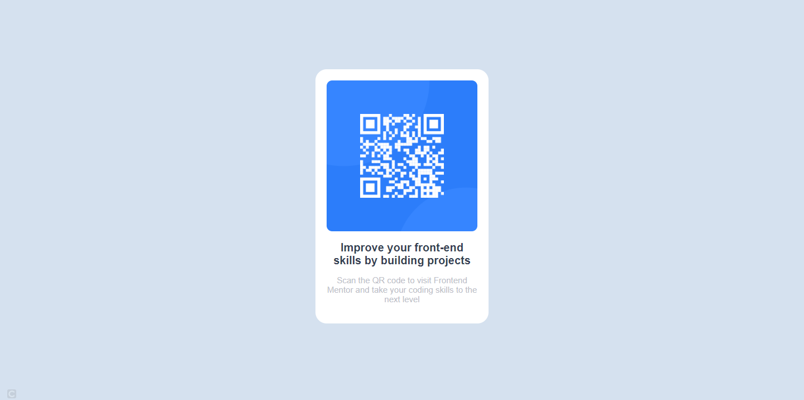

# Frontend Mentor - QR code component solution

This is a solution to the [QR code component challenge on Frontend Mentor](https://www.frontendmentor.io/challenges/qr-code-component-iux_sIO_H). Frontend Mentor challenges help you improve your coding skills by building realistic projects. 

## Overview

This project is based on pure HTML and CSS, but it provides us with a lot of learning.

### Screenshot




## My process

### Built with

- Semantic HTML5 markup
- CSS custom properties
- Flexbox
- CSS Grid


### What I learned

I was able to better understand the use of CSS Grid, and that to center something in the center of the screen, just give a width and height for the child element to be centered, as the centering will be according to the height and width of the parent element.

To see how you can add code snippets, see below:

```html
<div class="parent-element">
  <div class="child-element">Element to be centered</div>
</div>
```
```css
.parent-element {
  display: grid;
  place-content: center;
  width: 100%;
  height: 100vh;
}
```

### Continued development

I want to continue studying JS, and for when I "finish" my studies in JS, start in TypeScript.


## Author

- Frontend Mentor - [@YuutaKinoshi](https://www.frontendmentor.io/profile/YuutaKinoshi)
